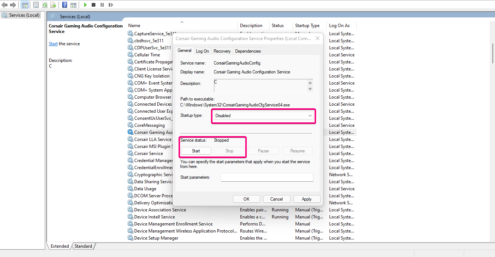

### Origin/EA

EA games bought on Steam do not actually disable the origin overlay even if you have disabled it in   the launcher. 
   
   -  This causes stutters and causes some keys to stop giving input in the game.
   -  If you have noticed your character stopping even when you have pressed the button, this might fix it.
    
    Rename the "igo64.dll" to "igo64" on C:\Program Files (x86)\Origin

### Epic Launcher

Epic Games Launcher still does not have the functionality to remember games on external hdds.  Having to re-verify them is a pain.

  > Go to <b>C:\ProgramData\Epic\EpicGamesLauncher\Data\Manifests</b>

  > Modify the <b>ManifestLocation, InstallLocation, and StagingLocation</b> values in the manifest to point to the new install directory using notepad.

  > Similarly for Unreal open <b>C:\ProgramData\Epic\UnrealEngineLauncher\LauncherInstalled.dat</b> and change <b>InstallLocation</b>

### iCUE

Corsair iCUE on laptops is a nightmare, constantly pings the dedicated gpu in the background, increasing idle temperatures and reducing battery life.  Most of these apply to laptops but can also be used for your desktop. Try and see what works.

All has to be done after every update

    - Go to C:\Program Files\Corsair\CORSAIR iCUE 4 Software
  
    - Rename the following files [Remove the .exe part]:
        > Corsair.Service.CpuIdRemote64
        > Corsair.Service.CpuIdRemote
        > Corsair.Service.DisplayAdapter
    
    - Search for Services on Windows and open the app, double-click, disable the following
        > CorsairGamingAudioConfig  (unless you use Corsair Audio Peripherals,  no difference even if)
        > CorsairMsiPluginService   (unless you have an MSI motherboard or Corsair Ram)
        > Corsair LLA Service       (unless you have RGB ram)

    

