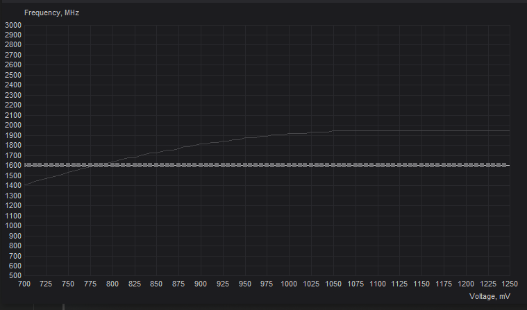
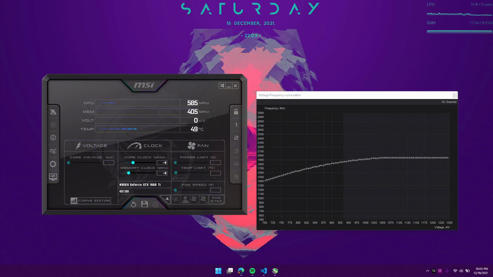

- [CPU](#cpu)
  - [Intel](#intel)
  - AMD (coming soon)
- [GPU](#gpu)

# Undervolting and Underclocking

> Undervolting refers to lowering the voltage sent to the CPU so that it produces less heat
> 
> Underclocking refers to limiting the boost clock of the CPU so that it produces less heat

---

> WSL2 does not allow you to undervolt the cpu if it is enabled. This is due to Virtual Machine Platform which is used by Windows to run WSL.
>
> This is only a problem in W11, in W10 you can both undervolt and run WSL 

## CPU
### **Intel**

Program Used : Throttlestop

I will only be listing out the profiles and some additional info. Read the in-depth guide for a better understanding.

Enable SpeedShift if you have the option in your bios.

[A more in-depth guide](https://www.ultrabookreview.com/31385-the-throttlestop-guide/)

>    These are just an example of my undervolt, yours might vary, **DO NOT COPY**
>    - Undervolt
        >        - Core :  -125mv
        > 
        >        - Cache : -120mv
>    - Core and cache do not have to be the same number, core can be much higher than the cache.
>    - The cache will bsod your pc first so get it right.
>    - You just have to test where the system BSODs
>    - Test the undervolt for a week and only then add it to the schedule in the above guide

For stress test use the Throttlestop bench option, if there is a single error on MAX size, change your undervolt

- 4 Profiles
  - Performance - For CPU intensive games/work (modded minecraft, editing)
  - No-Boost - For GPU intensive games/work (witcher 3, excel)
  - Quiet - For watching movies, music, light tasks
  - Battery - For pushing the battery to last longer

> ### For auto-switching to battery profile
> 

### For games/programs that require higher clocks
> - Performance
    >    - SpeedShift - 32
>    - 3.6 Multiplier all cores
You can do 3.5, I haven't seen any FPS gains >3.5Ghz 

### If you want to play and be on lower temps
> - No-Boost
    >    - SpeedShift - 32
>    - Boost off

### Browsing/Office Work
> - Quiet
    >    - SpeedShift - 192
>    - Boost off

### For the last 20% of your battery
> - Battery
    >    - SpeedShift - 255
>    - Boost off
>    - Almost becomes unusable but decent 

## GPU

#### Mostly for reducing laptop temps or desktop power consumption

<u>Method 1</u>

Quick

- Find out your max rated clock on the internet for your gpu

- Using MSI Afterburner set the frequency curve(CTRL+F) to the frequency found above

As an example, max clock of my 1660ti mobile is rated at 1.59GHz. So I locked it to 1600MHz

> Use shift + drag to select all points in the curve, select any one point, shift + enter and input the frequency

> Do not run Afterburner on start up on laptops, it will constantly ping the dgpu and reduce battery life

<u>Method 2</u>

Run a benchmark such as [Heaven benchmark](https://benchmark.unigine.com/heaven)

Keep running it in the background and open up msi afterburner curve editor.
The lower axis represents the voltage of the GPU.

- Check the clock where you gpu boosts to with optimal temps
- Find out in the curve editor where the voltage of the frequency you found out match
- Pick a lower voltage and set the frequency on that point to the optimal frequency
- Apply and the rest should be set to the same
- Keep doing this until heaven benchmark freezes or crashes, that's the minimum
- Keep the optimal to 1 or 2 points higher in the afterburner

    
