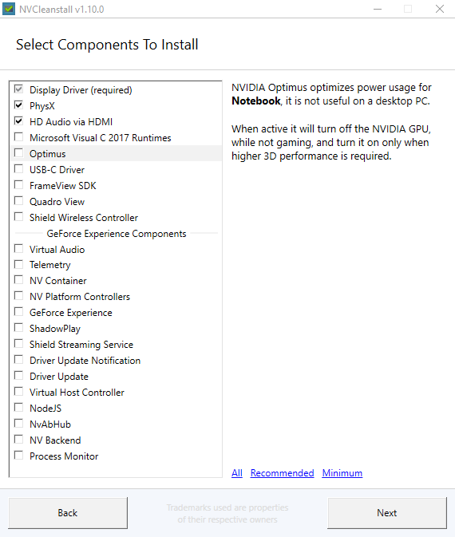
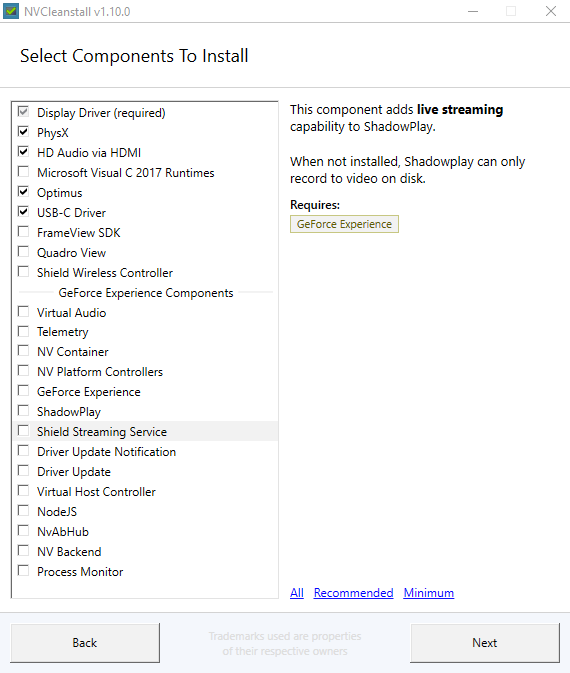

I will assume you have an installed windows 11 Home or Pro, with your desired partitions laid out. There isnt anything to tweak in those.

I use [Hibit Portable](http://www.hibitsoft.ir/Uninstaller.html) for any uninstallations

- ## First time boot up

  - Update Windows
  - Remove if you don't use OneDrive
     

  > **On Tools >> Windows Store Apps Manager**
    - Calender
    - Cortana
    - Get Help
    - Groove Music
    - Maps
    - Microsoft News
    - Microsoft Pay
    - Microsoft Solitare Collection
    - Mixed Reality Portal
    - Movies and TV
    - Office
    - OneDrive
    - People
    - Power Automate
    - Tips
    - Voice Recorder
    - Weather
    - Your Phone

  > **From Start Menu**
    - Spotify
    - Disney+
    - ClipChamp
    - PrimeVideo
    - TikTok
    - Instagram
    - Facebook
    - Ads if any

- ## Drivers

  - ### Nvidia

    - Use NVCleanInstall 
    - Manually select driver version, choose your preferred driver version and platform

      > For desktops
      > 

      > For laptops
      > 

    - If you want Geforce experience/Shadowplay select the modules or download your drivers from the official website, but imo these can be easily replicated and they just add unwanted telemtry and use up resources

    > **Some laptops require the usb-c module for the optimus to work, Turing and above.**

    - These remove the bloat that is installed with nvidia drivers and the background services

  - ### AMD/Intel

    - I haven't have had any device from AMD but the general consensus is to use the official installer as it's pretty good

    - Intel Update Assistant is preferred. Install it, upgrade your drivers and uninstall it

**Most other drivers will be installed by windows update, unless you have a specific hardware of which you have to do your own research**
