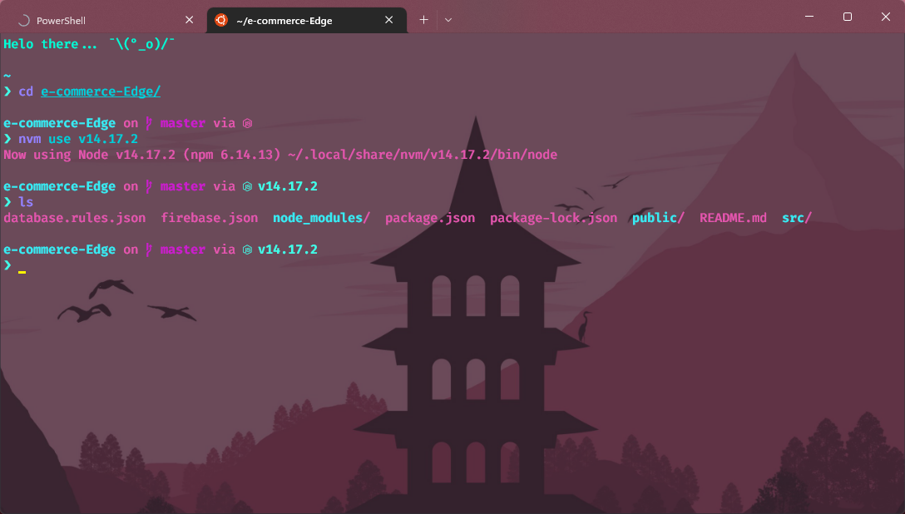

I primarily use WSL2 for my development work, with the occasional VM with Linux Mint.

### [Fish Shell](https://fishshell.com/)

     Much faster than BASH or ZSH
     Less plugin support but faster plugins

### Slow ZSH?

    - Using NVM with zsh slows down the prompt of the shell
    - There are various guides to fix this, precaching and such but none of them worked for me
    - Switching to FISH shell was a decent enough workaround for my usecase

### [Fisher](https://github.com/jorgebucaran/fisher)
> Plugin Downloader/Manager for FISH

### [Starship](https://starship.rs/guide/#%F0%9F%9A%80-installation)
> My favourite theme for any shell

Too much transparency? I agree...

### [Nala](https://gitlab.com/volian/nala)

    A frontend alternative to APT in Ubuntu/Debian derivatives
    Supports parallel downloads and ranking of mirrors
